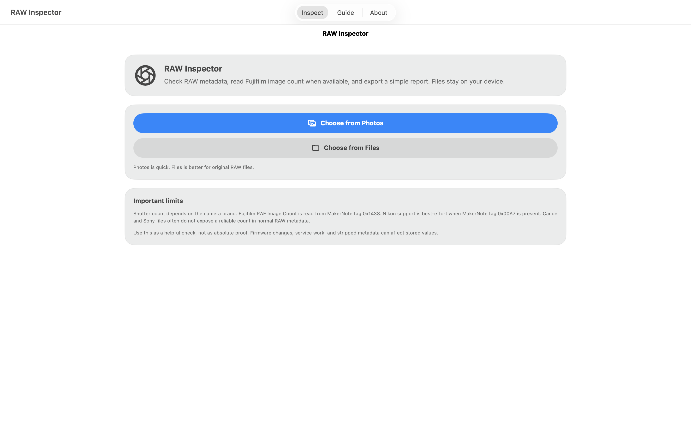
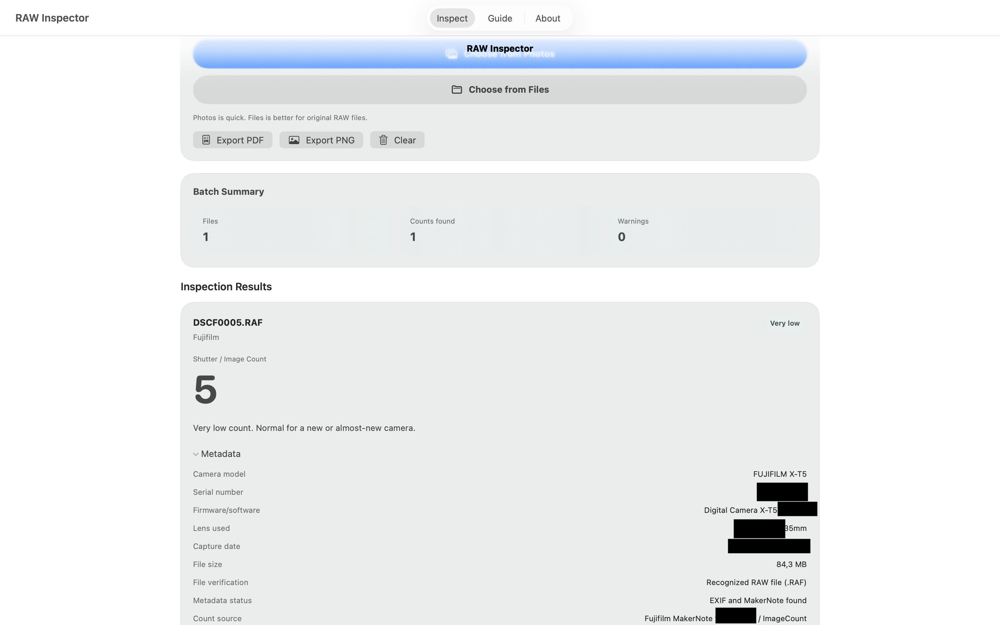
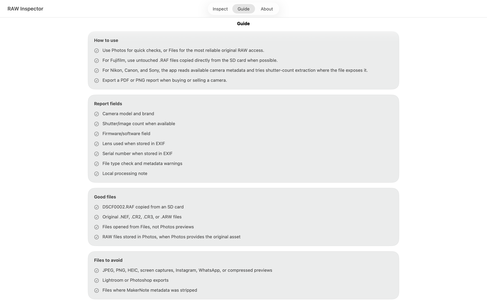
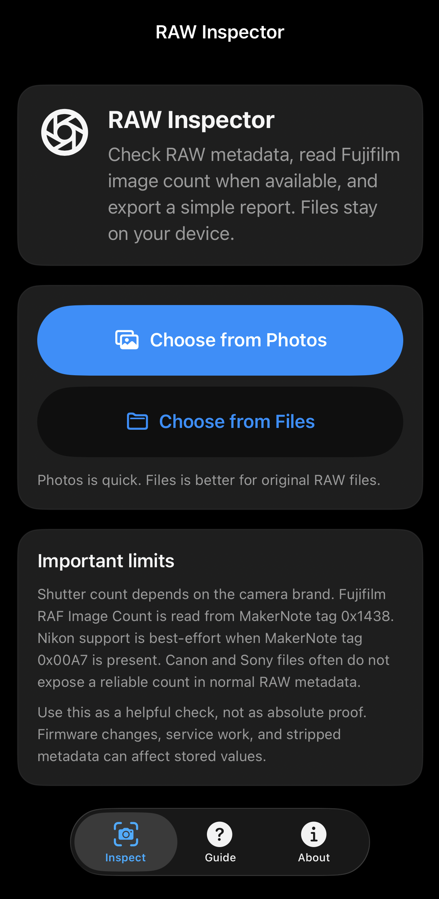
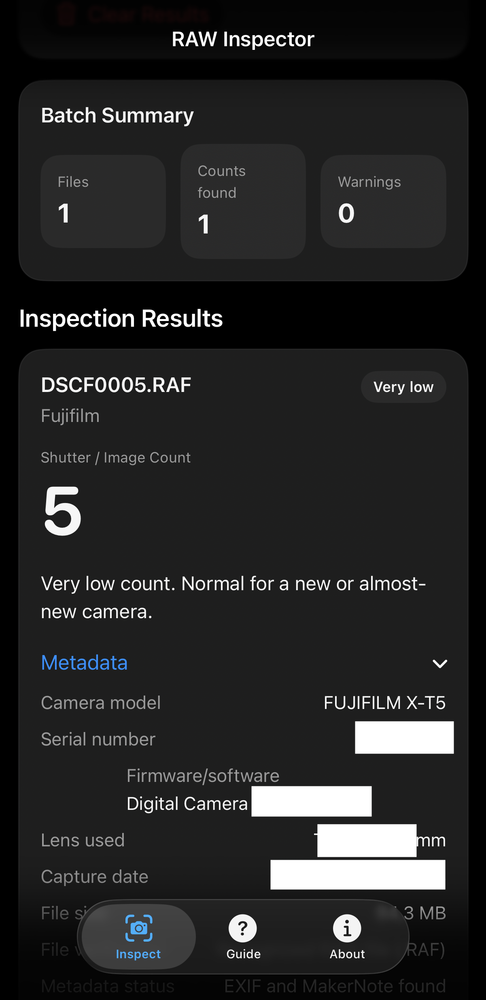

# RAW Inspector

RAW Inspector is a small SwiftUI app for checking camera RAW metadata on iPhone, iPad, and Mac.

It can read useful camera information from RAW files and, when available, show shutter/image count data. Fujifilm RAF files are the main supported path for shutter count.

## Product samples

  

  
  

  
  

## Features

- Open RAW files from Files
- Open images from Photos when available
- Inspect multiple files at once
- Show camera model, brand, lens, firmware/software, serial number, capture date, file size, and metadata status
- Read Fujifilm RAF Image Count when available
- Try Nikon shutter count when readable MakerNote data is present
- Show metadata reports for Canon, Sony, and other RAW files
- Export a PDF or PNG report
- Local processing only

## Supported files

- Fujifilm RAF
- Nikon NEF / NRW
- Canon CR2 / CR3
- Sony ARW
- Other RAW files when iOS/macOS can read their metadata

## Important notes

Shutter count is not stored the same way by every camera brand.

Fujifilm RAF files usually give the best result because the app reads the Image Count value from MakerNote data. Nikon support depends on the file and camera model. Canon and Sony files often do not expose shutter count in normal RAW metadata, so the app may show metadata without a count.

For the best result, use original RAW files copied directly from the camera card. Avoid screen captures, social media files, compressed previews, and edited exports.

## Privacy

RAW Inspector works locally. Files are processed on the device. The app does not upload images, use analytics, show ads, or collect personal data.

## Build

Open `RAFShutterCount.xcodeproj` in Xcode and run the app on iPhone, iPad, Simulator, or Mac Catalyst.

Minimum targets:

- iOS / iPadOS 16+
- macOS 13+ through Mac Catalyst

## Legal

RAW Inspector is an independent utility. It is not affiliated with, endorsed by, or sponsored by Fujifilm, Canon, Nikon, Sony, or any camera manufacturer.

© 2026 Soroosh AGHAEI. All rights reserved.
